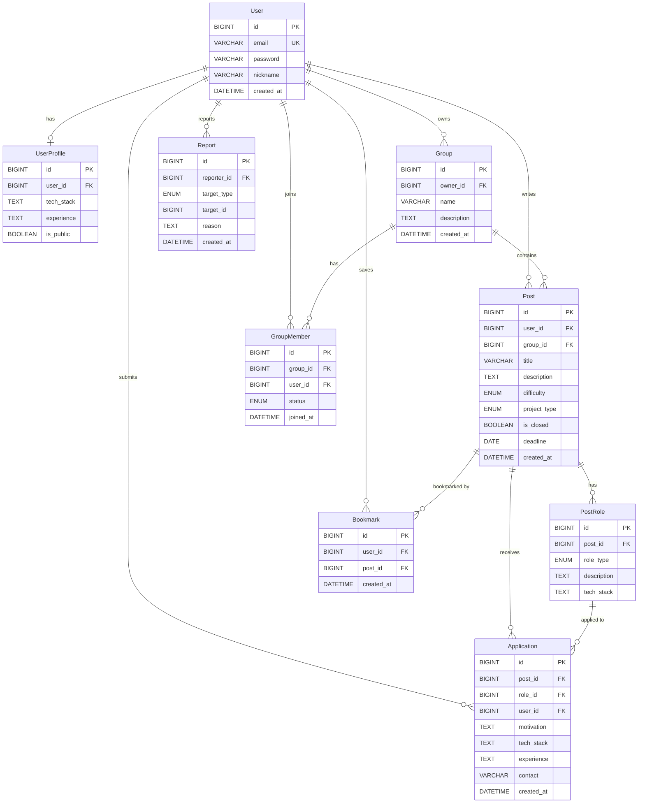

# 우리팀 ERD



## ENUM 정의

| 엔티티 | 컬럼 | 값 |
|---|---|---|
| Post | difficulty | `BEGINNER`, `INTERMEDIATE`, `ADVANCED` |
| Post | project_type | `SIDE_PROJECT`, `HACKATHON`, `GRADUATION`, `BOOTCAMP` |
| PostRole | role_type | `BACKEND`, `FRONTEND`, `DESIGN`, `PLANNING` |
| GroupMember | status | `PENDING`, `APPROVED` |
| Report | target_type | `POST`, `USER` |

## 비고

- `Post.group_id` — nullable. 그룹 지정 시 해당 그룹 소속 공고로 제한 (Could)
- `Post.deadline` — nullable. 설정 시 자동 마감 처리 (Could)
- `Group`, `GroupMember`, `Bookmark`, `Report` — Could 범위
- `UserProfile` — Should 범위

---

## 데이터 구조 및 흐름 해설

### 핵심 흐름: "공고 올리기 → 역할 나누기 → 지원하기"

```
User (사람)
  └─ Post (공고 하나)
       └─ PostRole (역할 여러 개: 백엔드, 프론트, 디자인, 기획)
            └─ Application (각 역할에 대한 지원서)
```

### User — 모든 것의 주체

사람 한 명 = User 한 행(row). 공고, 지원서, 북마크 등 파생되는 모든 데이터는 `user_id`로 User를 가리킨다.

### Post + PostRole — 핵심 설계 포인트

Post를 PostRole과 분리한 이유는 **"하나의 공고가 여러 역할 탭에 동시에 노출"** 되어야 하기 때문이다.

> 예: "해커톤 팀원 구합니다 — 백엔드 1명, 프론트 2명, 디자인 1명"
> → 이 공고 하나가 백엔드 탭, 프론트엔드 탭, 디자인 탭 세 곳에 동시 노출

- **Post** = 공고의 공통 정보 (프로젝트 소개, 난이도, 유형 등)
- **PostRole** = 역할별 세부 정보 (할 일, 필요 기술스택). `role_type`이 노출 탭을 결정

Post 1개에 PostRole이 N개 붙고, 각 PostRole의 `role_type`이 탭을 결정한다.

### Application — "어떤 공고의 어떤 역할에" 지원

Application이 `post_id`와 `role_id` **둘 다** 가지는 이유:
- `role_id`만으로도 어느 역할인지 알 수 있지만, `post_id`가 있으면 "이 공고에 온 지원서 전체"를 조회할 때 join 없이 바로 조회 가능 (성능)
- 게시자 권한 체크: `Post.user_id == 현재 로그인 유저`이면 지원자 목록 열람 허용

### UserProfile — 공개 명함 (Should)

User와 1:1 관계. `is_public = true`인 사람만 회원 프로필 목록에 노출된다. 공고·지원 흐름과 별개로, 구인자가 눈에 띄는 사람에게 직접 먼저 연락하는 용도.

### Could 엔티티 정리

| 엔티티 | 역할 | 핵심 연결 |
|---|---|---|
| `Bookmark` | 관심 공고 저장 | `user_id` + `post_id` 쌍 |
| `Group` | 소속 단체(대학, 부트캠프 등) | `owner_id` → User |
| `GroupMember` | 그룹 가입 신청/승인 | `group_id` + `user_id`, `status`: PENDING → APPROVED |
| `Report` | 공고/유저 신고 | `target_type`(`POST` or `USER`) + `target_id`로 다형성 참조 |

`Post.group_id`는 nullable — null이면 전체 공개, 값이 있으면 해당 그룹 소속 공고.

### 전체 데이터 흐름

```
[팀원 모집]
User 가입
  → Post 작성 (제목, 설명, 난이도, 프로젝트유형)
    → PostRole 추가 (백엔드: "Node.js 경험자", 프론트엔드: "React 경험자")
      → 백엔드 탭 + 프론트엔드 탭 양쪽에 공고 노출

[팀 합류]
비회원/회원이 공고 상세 열람
  → 원하는 역할(PostRole) 선택
    → Application 제출 (지원동기, 기술스택, 연락처)
      → 게시자(Post.user_id)만 지원자 목록 조회 가능
```

---

## 0615 수정본 — 구현 반영 변경 사항

> 6/5~6/12 작업으로 실제 구현(엔티티)이 위 원본 ERD에서 변경/추가됨. 원본은 기록으로 남기고, 변경분만 정리.

### Post

| 컬럼 | 변경 |
|---|---|
| `deadline` (DATE) | → `application_deadline` (DATE)로 이름 변경. "자동 마감 처리"는 미구현이며, 현재는 `GET /api/posts` 목록 조회 시 마감일이 지난 공고를 제외하는 용도로만 사용 |
| `project_start_date` (DATE) | 신규 추가. 프로젝트 시작일 |
| `project_end_date` (DATE) | 신규 추가. 프로젝트 종료일 |

### UserProfile (Should — 구현 완료)

| 컬럼 | 변경 |
|---|---|
| `career_type` (ENUM) | 신규 추가. 값: `NON_MAJOR_STUDENT`, `MAJOR_STUDENT`, `BOOTCAMP`, `JOB_SEEKER`, `JUNIOR`, `SENIOR`, `OTHER` |
| `contact_email` (VARCHAR) | 신규 추가. 공개 프로필에 노출되는 연락용 이메일. `is_public = true`로 설정하려면 필수 |

### Application

| 컬럼 | 변경 |
|---|---|
| `withdrawn` (BOOLEAN, default false) | 신규 추가. 지원 철회 시 레코드를 삭제하지 않고 `true`로 표시하는 소프트 삭제 — 재지원 시 기존 내용 복원 가능 |

### ENUM 변경

| 엔티티 | 컬럼 | 변경 전 | 변경 후 |
|---|---|---|---|
| Post | project_type | `SIDE_PROJECT`, `HACKATHON`, `GRADUATION`, `BOOTCAMP` | `SIDE_PROJECT`, `GRADUATION`, `HACKATHON`, `STUDY`, `OTHER` |

### 신규 ENUM

| 엔티티 | 컬럼 | 값 |
|---|---|---|
| UserProfile | career_type | `NON_MAJOR_STUDENT`, `MAJOR_STUDENT`, `BOOTCAMP`, `JOB_SEEKER`, `JUNIOR`, `SENIOR`, `OTHER` |

### 비고 갱신

- `UserProfile`은 더 이상 "Should 미구현"이 아니라 구현 완료 상태 (`docs/api-spec.md` 4-4/4-5, 5-1/5-2 참고)
- `Post.deadline`은 "설정 시 자동 마감 처리(Could)"가 아니라 현재는 목록 제외 필터로만 동작. `closed` 자동 전환 스케줄러는 여전히 미구현(Could)
- `Group`, `GroupMember`, `Bookmark`, `Report`는 원본 ERD 그대로 미구현(Could) 상태 유지